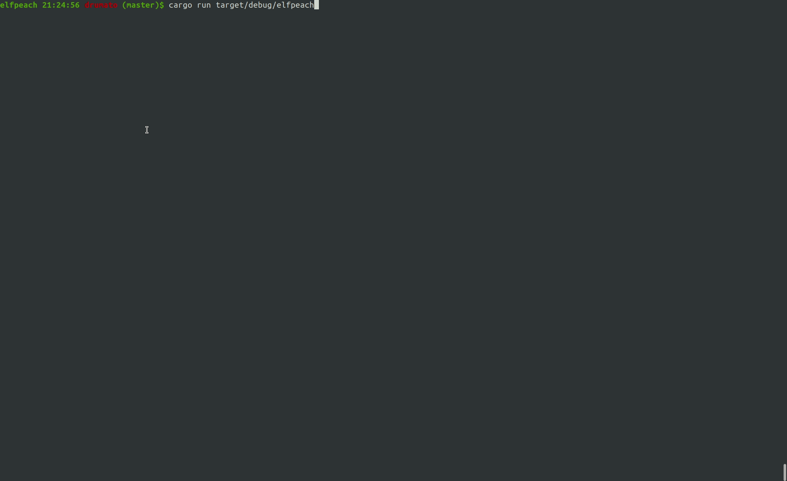

# elfpeach



An TUI based elf analyzer

## TODO

- [x] ELF header
- [x] section header table
  - [x] each section information
    - ex. symbol table's relative string table
  - [ ] hexdump
- [ ] program header table
- [ ] symbols
- [ ] dymanic information
- [ ] relocation symbols

## Usage

```
cargo run <file-path>
# or
./elfpeach <file-path>
```

|  key  |  description  |
| ---- | ---- |
|  `q`  |  quit  |
|  `←/→`  |  change attribute  |
|  `↑/↓`  |  change section/segment/symbol  |
